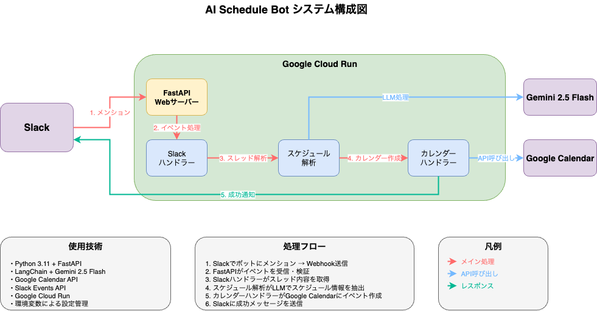

# SlackBot-AIScheduler

## 📋 システム概要

SlackでメンションされたスレッドをLLMで解析し、Google Calendarに自動でスケジュールを登録するシステム

### 主要機能
- Slackメンション検知によるトリガー
- スレッド内容のLLM解析（自然言語処理）
- Google Calendar への自動スケジュール登録
- Slack への処理完了通知

## 🏗️ システム構成

### アーキテクチャ図
```
[Slack] → [Cloud Run] → [Gemini 2.5 Flash] → [Google Calendar API]
```


### 技術スタック
| 要素 | 技術選択 |
|------|----------|
| **プラットフォーム** | Google Cloud Run |
| **言語** | Python 3.11 |
| **Webフレームワーク** | FastAPI |
| **LLMフレームワーク** | LangChain |
| **LLMモデル** | Gemini 2.5 Flash |
| **ログ** | Python logging |

### プロジェクト構造
<!-- ```
ai-schedule-bot/
├── src/
│   ├── handlers/
│   │   ├── __init__.py
│   │   ├── slack_handler.py           # Slackイベント処理
│   │   ├── schedule_analyzer.py       # LLMによるスケジュール解析
│   │   └── calendar_handler.py        # Google Calendar連携
│   ├── models/
│   │   ├── __init__.py
│   │   ├── schedule_models.py         # データモデル定義
│   │   └── database.py                # データベース層（オプション）
│   ├── config/
│   │   ├── __init__.py
│   │   ├── settings.py                # 設定管理
│   │   └── environments.py            # 環境別設定
│   ├── utils/
│   │   ├── __init__.py
│   │   ├── auth.py                    # 認証処理
│   │   ├── logger.py                  # ログ処理
│   │   ├── monitoring.py              # 監視・メトリクス
│   │   └── slack_verification.py      # Slack署名検証
│   └── main.py                        # メインアプリケーション
├── tests/
│   ├── __init__.py
│   ├── test_integration.py            # 統合テスト
│   ├── test_schedule_analyzer.py      # 解析テスト
│   └── test_calendar_handler.py       # Calendar連携テスト
├── requirements.txt                   # 依存関係
├── Dockerfile                         # コンテナ設定
├── cloudbuild.yaml                    # ビルド設定
├── .env.example                       # 環境変数例
└── README.md                          # ドキュメント
``` -->

### 処理フロー
```
1. Slack Events API からのWebhook受信
   ├── URL verification処理
   ├── 署名検証（セキュリティ）
   └── 即座にACK応答（3秒以内）

2. 非同期処理（バックグラウンド）
   ├── スレッド内容取得（Slack API）
   ├── LLM解析（Gemini 2.5 Flash）
   ├── 信頼度チェック
   ├── 空き時間確認（Google Calendar API）
   ├── イベント作成（Google Calendar API）
   └── 完了通知（Slack API）

3. エラーハンドリング
   ├── 各段階でのエラー処理
   ├── Slackへエラー通知
   └── ログ記録
```

### データモデル
```python
# ScheduleInfo
class ScheduleInfo(BaseModel):
    title: str                    # 会議タイトル
    start_time: datetime          # 開始時刻
    end_time: datetime            # 終了時刻
    attendees: List[str]          # 参加者メール
    description: Optional[str]    # 会議詳細
    location: Optional[str]       # 場所
    confidence: float             # 抽出信頼度

# SlackEvent
class SlackEvent(BaseModel):
    type: str                     # イベントタイプ
    channel: str                  # チャンネルID
    user: str                     # ユーザーID
    text: str                     # メッセージ内容
    ts: str                       # タイムスタンプ
    thread_ts: Optional[str]      # スレッドタイムスタンプ
```

### セキュリティ設定
```yaml
# Google Cloud IAM
サービスアカウント: ai-schedule-bot-sa
権限:
  - Calendar API (編集権限)
  - Cloud Logging (書き込み権限)
```

### Cloud Run設定
```yaml
# デプロイメント設定
リソース:
  CPU: 1 vCPU
  メモリ: 512Mi
  同時実行数: 100
  タイムアウト: 300s
  
スケーリング:
  最小インスタンス: 0
  最大インスタンス: 10
  
ネットワーク:
  外部アクセス: 許可
  認証: 不要（Slack署名で検証）
```